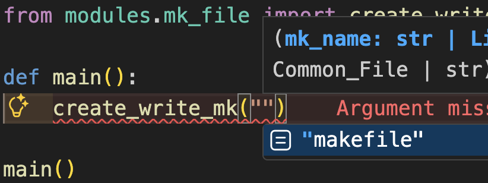
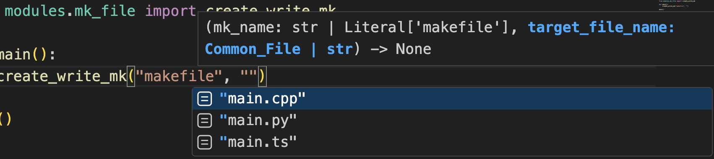

# Makefile Generator Module

## Usage
Heads up: This is a Python-only module.

1. Install the module with pip:
```bash
pip install makefile-generator==1.0.1
```
2. Use the module by importing it:
```py
from mk_generator import create_write_mk
```
3. Call the function (`create_write_mk()`):
```py
create_write_mk("makefile", "main.cpp")
```

- Example usage file: [example.py](/example.py)

## Supported Languages
* C++
* Python
* TypeScript

## Features
- Self documented module
- The parameters of `create_write_mk()` can be autocompleted:

